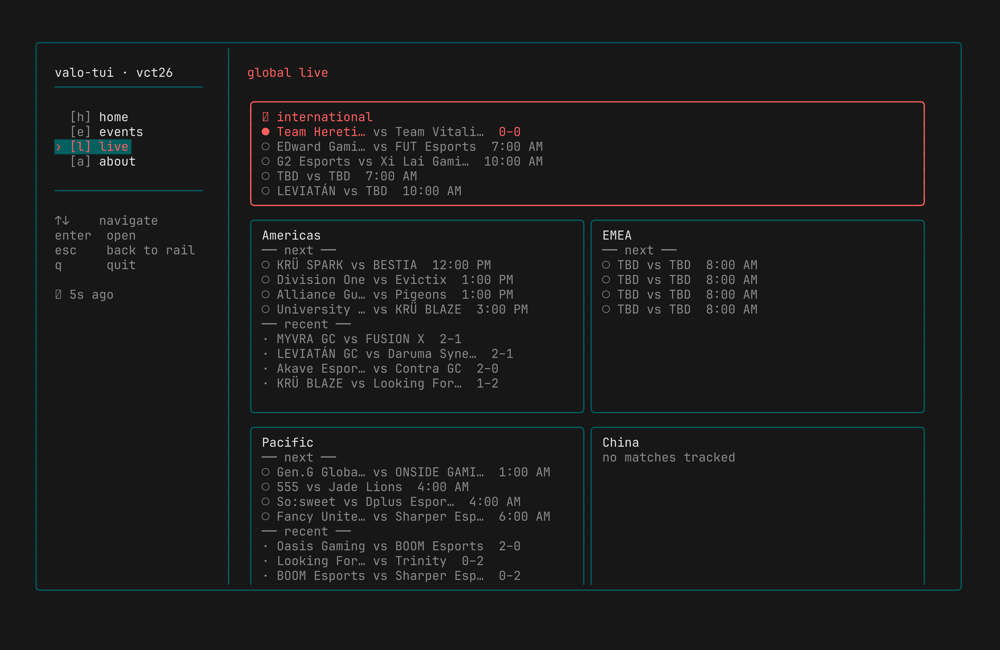
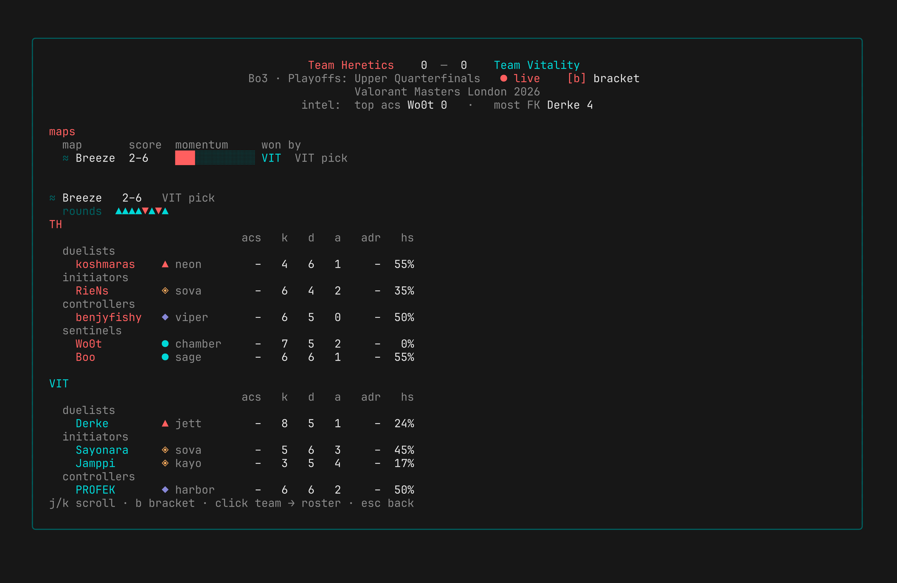
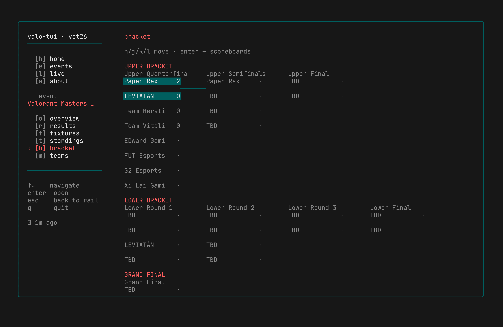
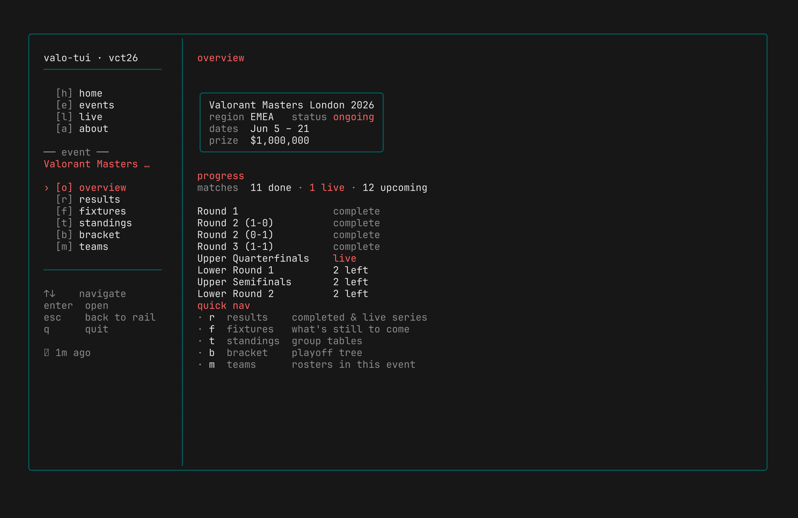
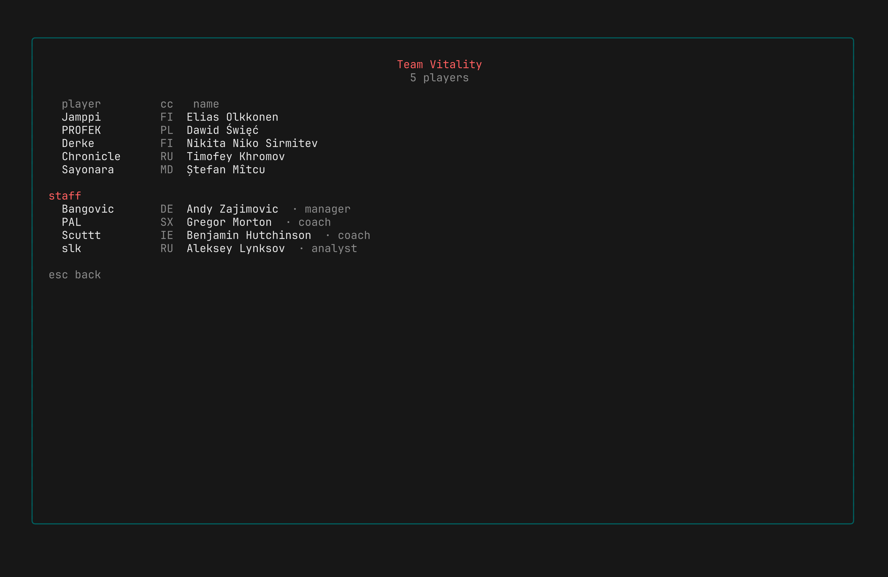

<div align="center">

<pre>
██╗   ██╗ █████╗ ██╗      ██████╗    ████████╗██╗   ██╗██╗
██║   ██║██╔══██╗██║     ██╔═══██╗   ╚══██╔══╝██║   ██║██║
██║   ██║███████║██║     ██║   ██║█████╗██║   ██║   ██║██║
╚██╗ ██╔╝██╔══██║██║     ██║   ██║╚════╝██║   ██║   ██║██║
 ╚████╔╝ ██║  ██║███████╗╚██████╔╝      ██║   ╚██████╔╝██║
  ╚═══╝  ╚═╝  ╚═╝╚══════╝ ╚═════╝       ╚═╝    ╚═════╝ ╚═╝
</pre>

**Valorant esports in your terminal: live scores, results, and full per-map scoreboards.**


-22c55e)


</div>

---

## 📺 Watch now (no install)

A live instance is already running. From any terminal on macOS, Linux, or
Windows (WSL / PowerShell), SSH in and you land straight in the read-only TUI.
No account, no password, nothing to install:

```bash
ssh valo.black-pantha.com
```

Press `q` to quit. That's the whole thing. Read on if you want to run your own.

---

`valo-tui` is a fast, read-only terminal UI for tracking Valorant esports: the
four Tier-1 regional leagues (Americas, EMEA, Pacific, China), the international
events (Masters / Champions), and the long tail of Challengers and Game Changers
tournaments, down to per-map scoreboards, round momentum, and team rosters.

It reads from a cached backend, so the UI is instant and **never rate-limited**:
one polite worker scrapes [vlr.gg](https://vlr.gg) for everyone. The same TUI
runs locally **or** is served over SSH with [Wish](https://github.com/charmbracelet/wish),
so you can host a single instance and let anyone `ssh` in to watch.

Built in Go on the [Charm](https://charm.land) stack: **Bubble Tea v2** runtime,
**Lip Gloss v2** styling, **Wish v2** SSH.

<div align="center">



*The global live dashboard: every Tier-1 region at a glance (live: Masters London 2026).*

</div>

## ✨ Features

- **Live & upcoming matches** across every Tier-1 region, refreshed on a fast ticker.
- **Match detail**: broadcast-style header, series momentum, per-map scoreboards
  grouped by agent role, and round-by-round momentum.
- **Event pages**: overview, results, fixtures, standings, an ASCII double-elim
  bracket, and clickable team rosters.
- **Full coverage**, not just VCT: completed matches of every tracked event get
  full per-map scoreboards backfilled politely in the background.
- **Freshness you can see**: a `↻ 42s ago` indicator that flips to `⚠ stale` /
  `⚠ fetch failing` the moment the worker falls behind, so dead data is never silent.
- **Serve over SSH**: one host, many viewers, zero extra load on vlr.gg.
- **Read-only by design**: no shell, no writes; safe to expose publicly.

## 📸 Screenshots

<table>
<tr>
<td width="50%"><br><sub><b>Live match detail</b>: broadcast header, per-map momentum, round timeline, and agent-grouped scoreboards (live: Heretics vs Vitality).</sub></td>
<td width="50%"><br><sub><b>Bracket</b>: the full ASCII double-elimination tree.</sub></td>
</tr>
<tr>
<td width="50%"><br><sub><b>Event overview</b>: series progress and quick-nav into every event page.</sub></td>
<td width="50%"><br><sub><b>Team roster</b>: players and staff, drilled in from standings or teams.</sub></td>
</tr>
</table>

<sub>Screenshots captured live from <a href="https://vlr.gg">vlr.gg</a> during Valorant Masters London 2026.</sub>

The splash, home, events, about, results, fixtures, standings, and teams pages
are in [`screenshots/`](screenshots/).

## 🛠 Dev / run it yourself

```bash
# Build the binaries
go build -o bin/ ./cmd/...

# Populate the cache from vlr.gg (one-shot), or seed sample data offline
go run ./cmd/valo-fetcher --once     # live scrape
go run ./cmd/valo-seed               # offline sample data

# Run the TUI locally
go run ./cmd/valo-tui
```

### Keep the cache fresh (worker)

```bash
# Poll vlr.gg on per-key cadences (live fast, results/events/detail slower).
go run ./cmd/valo-fetcher --watch --interval 30s

# Override any cadence per deployment:
go run ./cmd/valo-fetcher --watch \
  --interval 20s --series-interval 45s --results-interval 5m --events-interval 20m
```

### Serve it over SSH (Wish)

```bash
go run ./cmd/valo-tui-ssh            # listens on :23234, generates its own host key
# from another terminal:
ssh -p 23234 localhost
```

The username is ignored; a connection drops straight into the read-only TUI.

## 📦 Deploy to Proxmox (one command)

For a real deployment, the [`proxmox/`](proxmox/) kit builds a hardened,
**unprivileged** LXC where the *only* SSH surface is the read-only TUI; there
is no shell to reach. On the Proxmox VE host:

```bash
bash -c "$(curl -fsSL https://raw.githubusercontent.com/jashkarangiya/valo-tui/main/proxmox/install.sh)"
```

It creates the container, builds from `main`, installs sandboxed systemd
services, and prints the connection details. Interactive with sane defaults, or
fully scriptable via env vars, including `update.sh` and `uninstall.sh` for the
lifecycle. See [`proxmox/README.md`](proxmox/README.md) for the full security
model. Generic bare-metal / VM setup lives in [`deploy/`](deploy/).

### Expose it with a Cloudflare Tunnel (no open ports)

To reach the host from anywhere **without** forwarding a router port or revealing
your IP, route the Wish TUI through a Cloudflare Tunnel. Inside the container:

```bash
TUNNEL_HOSTNAME=valo.black-pantha.com bash proxmox/cloudflare.sh
```

It installs `cloudflared`, creates a named tunnel, and proxies **only**
`ssh://localhost:<port>` (nothing else). Viewers then connect with **one
command** (`curl … | sh` on macOS/Linux/WSL or `irm … | iex` on Windows) that
installs the `cloudflared` client and drops them straight into the TUI; the same
command reconnects later. No open ports, no router config. See
[`connect/`](connect/).

## 🏗 Architecture

A decoupled **worker / cache** design. TUI clients only ever *read* SQLite; a
separate fetcher polls vlr.gg and writes JSON blobs into a `kv` table. The cache
is the whole trick: **request volume to vlr.gg is fixed no matter how many people
connect.** SQLite runs in WAL mode, so the single writer (fetcher) and many
readers (every session) never block each other.

For a local run the path stops at `valo-tui`. For the public instance, the
home-hosted TUI is exposed through a small cloud relay over an outbound reverse
SSH tunnel, so there are no inbound ports open at home:

```
    ┌──────────────────────────────┐
    │            vlr.gg            │
    │        (data source)         │
    └───────────────▲──────────────┘
                    │ polite polling (~1.5s/req, rate-limited)
                    │
    ┌──────────────────────────────┐
    │         valo-fetcher         │
    │  (single background poller)  │
    └───────────────┬──────────────┘
                    │ writes
                    ▼
    ┌──────────────────────────────┐
    │    cache.db (SQLite, WAL)    │
    └───────────────┬──────────────┘
                    │ reads (one writer, many readers)
                    ▼
    ┌──────────────────────────────┐
    │         valo-tui-ssh         │
    │      (Wish SSH server)       │
    │    inside a hardened LXC     │
    │     read-only, no shell      │
    └───────────────┬──────────────┘
                    │ outbound reverse SSH tunnel (autossh)
                    │ persistent, auto-reconnect, no inbound ports at home
                    ▼
    ┌──────────────────────────────┐
    │      cloud relay (VPS)       │
    │          valo-relay          │
    │   forwards SSH via tunnel    │
    └───────────────▲──────────────┘
                    │
                    │ ssh valo.black-pantha.com
                    │
    ┌──────────────────────────────┐
    │           Viewers            │
    │    (VCT fans, terminals)     │
    └──────────────────────────────┘
```

The relay only forwards the tunneled, read-only TUI; it holds no data and runs
no game logic. Viewers connect to the public hostname and land straight in the
TUI. A Cloudflare Tunnel (above) is an alternative to the relay when you would
rather not run a VPS.

The cache is stamped with a parser generation (`vlr.CacheVersion`). Bump that
constant when a parser changes the cached shape; on next start the fetcher
notices the stamp is stale, wipes the `kv` table, and repopulates through the
current parsers, with no clearing the DB by hand.

## ⌨️ Navigation

| Key       | Action                              |
| --------- | ----------------------------------- |
| `h`       | Home                                |
| `e`       | Events                              |
| `l`       | Global live dashboard               |
| `a`       | About                               |
| `↑` / `↓` | Move through the nav rail           |
| `Enter`   | Open the focused page / drill in    |
| `Esc`     | Back to the nav rail                |
| `q`       | Quit                                |

Once an event is focused, its sub-pages (overview / results / fixtures /
standings / bracket / teams) become reachable.

## ⚙️ Configuration

| Variable                | Used by        | Default                          |
| ----------------------- | -------------- | -------------------------------- |
| `VALO_TUI_DB`           | TUI + fetcher  | `~/.cache/valo-tui/cache.db`     |
| `VALO_TUI_SSH_HOST`     | `valo-tui-ssh` | `0.0.0.0`                        |
| `VALO_TUI_SSH_PORT`     | `valo-tui-ssh` | `23234` (use `22` for bare `ssh host`) |
| `VALO_TUI_SSH_HOST_KEY` | `valo-tui-ssh` | `.ssh/id_ed25519` (auto-generated) |

The fetcher cadences (`--interval`, `--series-interval`, `--results-interval`,
`--events-interval`) are flags; see `valo-fetcher --help`.

## 🤝 A good citizen to vlr.gg

There is exactly one shared worker (never per-user fetching) with an honest,
identifiable `User-Agent`, a ~1.5s floor between all requests, exponential
backoff that honours `Retry-After`, and conservative per-feed cadences. Scaling
viewers is free for the source site. Details in [`deploy/README.md`](deploy/README.md).

## 🗂 Project layout

```
cmd/
  valo-tui/       local TUI entrypoint
  valo-tui-ssh/   Wish SSH server (per-connection tea.Program)
  valo-fetcher/   vlr.gg worker → SQLite cache
  valo-seed/      offline sample data
internal/
  app/            root model, event-first routing shell
  screens/        one model per screen (splash, global_live, …)
  widgets/        sidebar, match line
  styles/         palette + lipgloss styles
  data/           read-side SQLite cache
  vlr/            vlr.gg scraper (matches, events, detail, rosters)
deploy/           systemd units + generic deploy guide
proxmox/          one-command unprivileged LXC installer + Cloudflare Tunnel
connect/          viewer one-liners (curl|sh, irm|iex) for the tunnel
```

## 🧭 Status

Feature-complete TUI (home, events, about, global-live dashboard, match-detail
broadcast view, and all event sub-pages) plus a live vlr.gg fetcher and the Wish
SSH server, all reading from the shared SQLite cache.

**v0.3.0** is deploy-ready: hardened Proxmox LXC installer, cache versioning,
full event-series backfill, and team rosters.

This is still a young project, so rough edges and bugs are expected. If you hit
one, an issue or a PR is very welcome. See [CONTRIBUTING.md](CONTRIBUTING.md).

## 🙏 Credits & inspiration

Built and maintained by [@jashkarangiya](https://github.com/jashkarangiya).

The terminal-UI concept was inspired by [ipl by @h0i5](https://github.com/h0i5/ipl);
huge thanks to that project for the spark. `valo-tui` is its own independent
take, built for Valorant esports on the Charm stack.

## 🤝 Contributing

Contributions of every size are welcome, from typo fixes to new screens. Read
[CONTRIBUTING.md](CONTRIBUTING.md) for the dev setup, build/test commands, and
the one hard rule: stay a good citizen to vlr.gg (one shared worker, never
per-user fetching).

## License

[MIT](LICENSE) © Jash Karangiya. Data is sourced from [vlr.gg](https://vlr.gg);
this project is an independent, unaffiliated client.

<div align="right"><sub><b>- blackpantha</b></sub></div>
